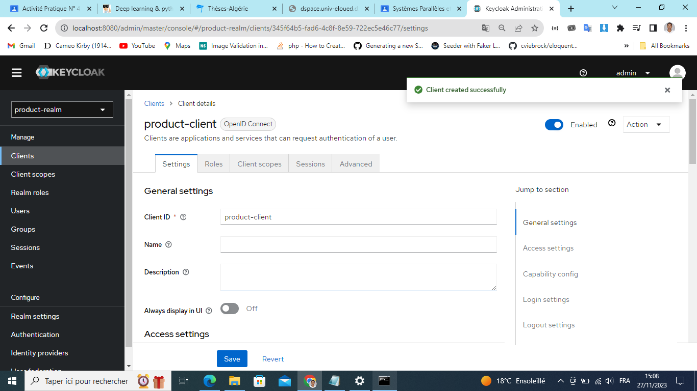
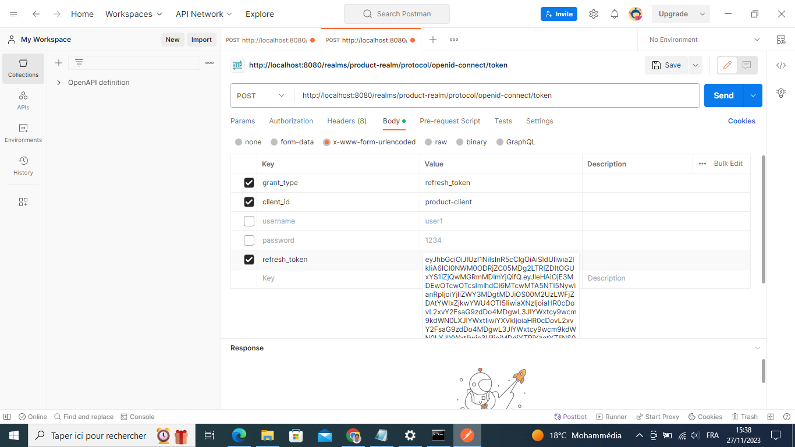
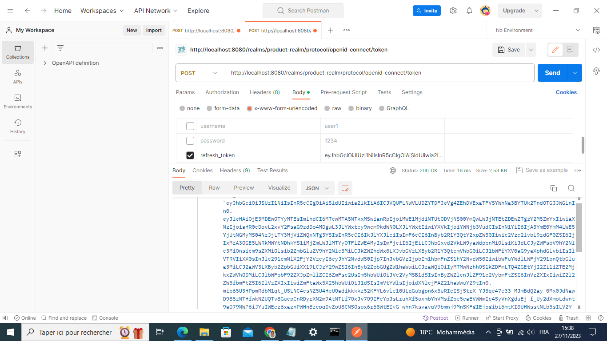
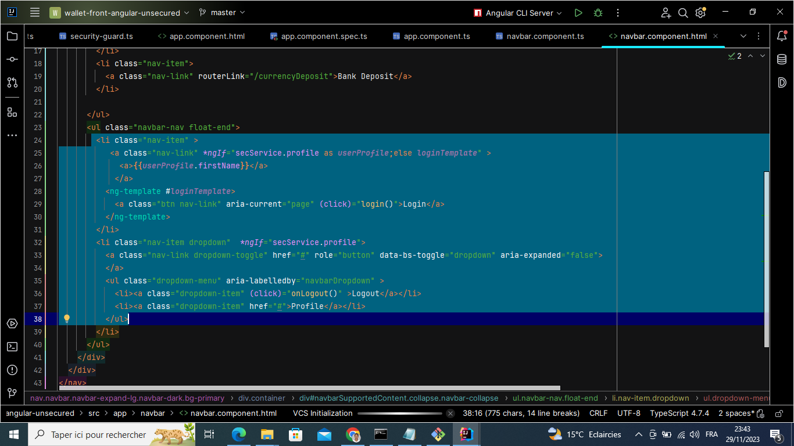

<h2>Compte rendu pour sécuritée une application wallet qui est développer par Systéme distribuée en utilisant Keycloak.</h2>
<h3>Partié 1 :  </h3>

<ul>
    <li>1. Télécharger Keycloak 19</li>
 
    

<li>2. Démarrer Keycloak</li>

<li>3. Créer un compte Admin</li>

<li>4. Créer une Realm</li>

<li>5. Créer un client à sécuriser</li>

<li>6. Créer des utilisateurs</li>

<li>7. Créer des rôles</li>

<li>8. Affecter les rôles aux utilisateurs</li>

<li>8. Affecter les rôles aux utilisateurs</li>
<h5>- Tester l'authentification avec le mot de passe</h5>

<h5>- Analyser les contenus des deux JWT Access Token et Refresh Token</h5>

<h5>- Tester l'authentification avec le Refresh Token</h5>

<h5>- Tester l'authentification avec Client ID et Client Secret</h5>

<h5>- Changer les paramètres des Tokens Access Token et Refresh Token</h5>

<h3>Partié 2 :  </h3>
<h2>Sécuriser Ebank Service</h2>
<ul>

<li>Ajouter les dépendances </li>
 
    

<li>application.properties</li>
 
    

    <li>Créer une package security contient deux classes qui sont constituée pour definir la configuration de sécuriter de notre micro service ebank-service </li>
 
    

    <li>Pour spécifier la quelle qui'il peut accéder à cette route</li>
 
    

</ul>
<h2>Sécuriser Wallet Front End ANGULAR</h2>

<ul>

<li>Installer Keycloak-js & Keycloak-angular </li>
 
    

<li></li>
 
    
<li></li>
 
    

<li></li>
 
    
<li></li>
 
    
<li></li>
 
    
<li></li>
 
    
<li></li>
 
    

</ul>

</ul>

